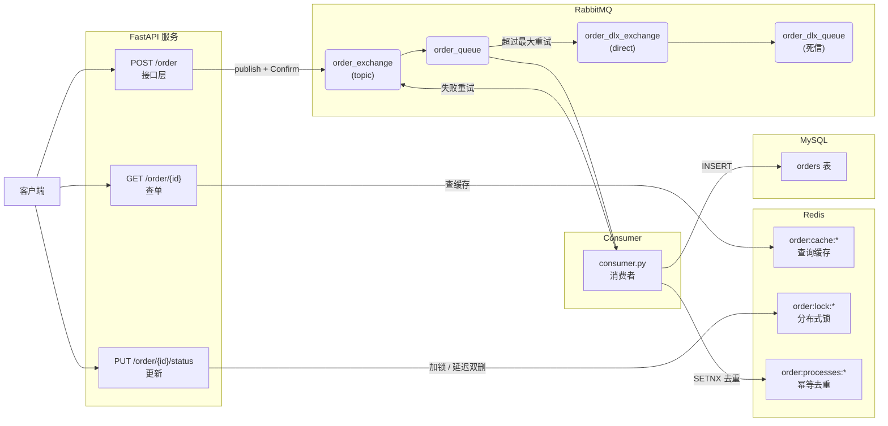
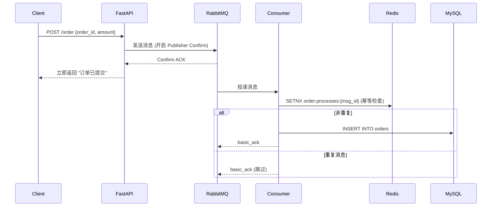

# Order System — 高并发订单系统

## 项目简介

一个基于 **FastAPI + RabbitMQ + Redis + MySQL** 的订单系统后端，覆盖分布式系统：

- 同步转异步下单（削峰填谷）
- 消息可靠性投递（Publisher Confirm + 手动 ACK）
- 幂等消费（Redis SETNX 去重）
- 失败重试 + 死信队列
- 缓存三大问题治理（穿透 / 击穿 / 雪崩）
- 分布式锁 + 延迟双删（缓存与 DB 一致性）

---

## 技术栈

| 分类       | 技术                        | 作用                             |
| ---------- | --------------------------- | -------------------------------- |
| Web 框架   | FastAPI + Uvicorn           | HTTP 接口服务（下单 / 查单 / 更新） |
| 消息队列   | RabbitMQ (pika)             | 订单异步处理、削峰填谷、解耦       |
| 缓存 / 锁  | Redis (redis-py)            | 查询缓存、分布式锁、幂等去重       |
| 数据库     | MySQL (PyMySQL)             | 订单持久化存储                     |
| 配置管理   | python-dotenv               | `.env` 环境变量加载               |

---

## 架构图



### 下单流程（时序）



---

## 怎么跑

### 前置条件

- Python 3.10+
- Docker Desktop（最快起 RabbitMQ + Redis）或本地装好这俩
- MySQL 8.0+

### 1. 起中间件

```bash
# RabbitMQ (带管理后台 http://localhost:15672 guest/guest)
docker run -d --name rabbitmq -p 5672:5672 -p 15672:15672 rabbitmq:3-management

# Redis
docker run -d --name redis -p 6379:6379 redis:7

# MySQL
docker run -d --name mysql -p 3306:3306 -e MYSQL_ROOT_PASSWORD=your_pwd mysql:8
```

### 2. 建库建表

```sql
CREATE DATABASE IF NOT EXISTS order_system DEFAULT CHARSET utf8mb4;
USE order_system;

CREATE TABLE orders (
    order_id    VARCHAR(64)  PRIMARY KEY,
    amount      DECIMAL(10,2) NOT NULL,
    status      VARCHAR(32)  NOT NULL DEFAULT 'created',
    create_time DATETIME     NOT NULL DEFAULT CURRENT_TIMESTAMP
) ENGINE=InnoDB DEFAULT CHARSET=utf8mb4;
```

### 3. 安装依赖

```bash
cd order_system
python -m venv venv
venv\Scripts\activate      # Windows PowerShell
# source venv/bin/activate  # Linux / macOS

pip install -r requirements.txt
```

### 4. 配置环境变量

复制模板并填入自己的密码：

```bash
copy .env.example .env
# 编辑 .env，改 MYSQL_PASSWORD
```

### 5. 启动

开 **两个终端**：

```bash
# 终端 A — 消费者（先起）
python consumer.py

# 终端 B — FastAPI 服务
uvicorn main:app --reload --port 8000
```

### 6. 测试

```bash
# 下单（正常）
curl -X POST http://localhost:8000/order ^
     -H "Content-Type: application/json" ^
     -d "{\"order_id\":\"order_001\",\"amount\":99.9}"

# 下单（模拟失败 —— order_id 含 bad 会进死信队列）
curl -X POST http://localhost:8000/order ^
     -H "Content-Type: application/json" ^
     -d "{\"order_id\":\"order_bad_003\",\"amount\":299.9}"

# 查单
curl http://localhost:8000/order/order_001

# 改状态（并发安全 —— 带分布式锁 + 延迟双删）
curl -X PUT "http://localhost:8000/order/order_001/status?status=paid"
```

---

## 模块说明

```
order_system/
├── main.py                 FastAPI 入口 —— HTTP 下单/查单/更新接口
├── producer.py             独立生产者脚本 —— 模拟发单（可选）
├── consumer.py             消息消费者 —— 幂等落库、失败重试、死信
├── mq_client.py            RabbitMQ 客户端封装 —— 连接、Confirm、交换机/队列声明
├── cache.py                Redis 缓存封装 —— 查询缓存读写、空值缓存（防穿透）
├── lock.py                 Redis 分布式锁 —— SET NX EX 加锁 + Lua 安全释放
├── db.py                   MySQL 封装 —— 建连接、增查改
├── config.py               统一配置 —— 从 .env 加载 + 业务常量
├── common/
│   └── redis_conn.py       公共 Redis 连接 —— 所有模块共用
├── .env.example            环境变量模板（实际值放 .env，已 gitignore）
└── requirements.txt        Python 依赖
```

| 模块        | 亮点                                                 |
| ----------- | -------------------------------------------------------- |
| `mq_client` | Publisher Confirm + mandatory = True，确保消息一定到 Broker |
| `consumer`  | Redis SETNX 幂等 + headers 计数重试 + 手动 ACK + 死信队列 |
| `cache`     | 空值缓存防穿透、随机 TTL 防雪崩、延迟双删保一致性         |
| `lock`      | SET NX EX 加锁、Lua 脚本保证"只删自己的锁"                |
| `main`      | 查询走缓存、更新走"加锁 → 删缓存 → 写 DB → 延迟再删"     |

---

## Redis 缓存设计（重点）

### 1. Key 设计

| 用途       | Key 模板                         | 值类型     | TTL 策略              |
| ---------- | -------------------------------- | ---------- | --------------------- |
| 订单查询缓存 | `order:cache:{order_id}`         | JSON / `__NULL__` | 基础 300s + 0~60s 随机偏移 |
| 空值缓存     | 同上（值为 `__NULL__`）           | 字符串     | 60s 固定              |
| 分布式锁     | `order:lock:{order_id}`          | UUID       | 10s 自动过期          |
| 幂等去重     | `order:processes:{message_id}`   | "1"        | 3600s（每小时清理）    |

### 2. 三大缓存问题治理

#### 缓存穿透（查不存在的数据）

```
GET order:cache:xxx → miss
    ↓
查 DB（也没有）
    ↓
SET order:cache:xxx = "__NULL__"   TTL = 60s   ← 空值缓存
```

关键点：空值缓存要**独立短 TTL**，防止永久缓存；值用特殊标记（`__NULL__`）而不是空字符串，区分"缓存 miss"和"缓存命中空值"。

#### 缓存击穿（热点 key 过期瞬间大量并发）

项目暂未实现独立的"热点 key 重建互斥锁"，热点 key 过期后的并发查询走常规"查 DB → 回填缓存"流程。

#### 并发更新防重（分布式锁）

并发更新同一订单会导致**缓存与 DB 不一致**（两个线程同时更新、同时删缓存、互相覆盖），用 **分布式锁** 串行化同一订单的写操作：

```python
lock_value = acquire_lock(order_id)       # SET NX EX 抢锁
try:
    delete_order_cache(order_id)          # 1. 先删缓存
    db.update_order_status(...)           # 2. 更新 DB
    threading.Thread(delayed_delete)       # 3. 延迟 1s 再删（防并发写回脏缓存）
finally:
    release_lock(order_id, lock_value)    # Lua: 校验 value 再删
```

#### 缓存雪崩（大量 key 同时过期）

所有查询缓存的 TTL 加 **随机偏移**：

```python
ttl = 300 + random.randint(0, 60)   # 300~360s 之间均匀分布
```

### 3. 缓存与 DB 一致性

采用 **延迟双删 + 分布式锁**：

```
线程 A (更新)        线程 B (查询)
    │                     │
    ├── 1. 删除缓存       │
    │                     ├── 2. 查缓存 → miss
    │                     ├── 3. 查 DB（旧值）
    │                     └── 4. 写回缓存（旧值！）  ← 脏缓存窗口
    ├── 5. 更新 DB       │
    └── 6. 延迟 1s 再删缓存 ← 把可能被线程 B 写回的旧值删掉
```

为什么用**先删缓存再写 DB**而不是反过来？因为写 DB 比删缓存慢，反过来的窗口更大（缓存是新值、DB 是旧值，更糟）。

延迟时间取多少？经验值是**大于一次读操作的耗时**（这里设 1s，生产用 500ms~2s 之间）。

### 4. 分布式锁安全释放

释放锁时不能直接 `DEL`，必须校验 value 是自己加的：

```lua
-- lock.py: UNLOCK_LUA
if redis.call("get", KEYS[1]) == ARGV[1] then
    return redis.call("del", KEYS[1])
else
    return 0
end
```

防止场景：线程 A 加锁 → 线程 A 业务慢导致锁自动过期 → 线程 B 加了同一把锁 → 线程 A 跑完直接 `DEL` 把 **线程 B 的锁** 删掉。

用 Lua 脚本是因为要保证"查 → 比 → 删"三步原子性。

---

## 项目难点（面试加分项）

| 难点                               | 问题描述                                                                 | 解决方案                                                |
| ---------------------------------- | ------------------------------------------------------------------------ | ------------------------------------------------------- |
| 并发更新导致缓存不一致             | 两个线程同时更新同一订单：线程 A 删缓存 → 线程 B 查缓存 miss 读 DB 旧值 → 线程 A 写 DB → 线程 B 把旧值写回缓存 | 分布式锁串行化 + **延迟双删**（写完 DB 延迟 1s 再删一次） |
| RabbitMQ 消息重复消费              | 网络抖动导致 Broker 重投、消费者重试时重复投递                          | Redis SETNX 幂等去重（`order:processes:{msg_id}`）+ 数据库主键 INSERT 兜底 |
| 消费者业务异常但 MySQL 也可能挂了  | 怎么区分"需要重试的临时错误"和"不该重试的业务错误"                      | `bad` 订单模拟业务异常直接进死信；MySQL 挂了抛异常 → 触发重试机制 |
| 分布式锁误删他人锁                 | 线程 A 持锁超时未释放，线程 B 抢到同一把锁，A 跑完直接 `DEL` 把 B 的锁删了 | 加锁 value 设 UUID，释放时用 **Lua 脚本**校验 value 一致性再删除 |

---

## 启动验证

### 快速检查清单

```
✅ Redis 连上
✅ RabbitMQ 连上
✅ MySQL 建表了
✅ 消费者跑着（终端 A 有 "订单消费者启动" 日志）
✅ API 跑着（http://localhost:8000/docs 能打开 Swagger）
```

### 验证步骤

**1. Swagger 页面**

浏览器打开 `http://localhost:8000/docs`，应该看到三个接口：

```
POST   /order                 下单
GET    /order/{order_id}      查单
PUT    /order/{order_id}/status  改状态
```

**2. 正常下单**

```bash
curl -X POST http://localhost:8000/order ^
     -H "Content-Type: application/json" ^
     -d "{\"order_id\":\"order_001\",\"amount\":99.9}"
```

期望 API 立即返回：
```json
{"message": "订单已提交，正在处理中", "message_id": "xxx"}
```

**3. 看消费者日志**

终端 A（消费者）应该出现：
```
📥 处理订单 (重试:0): order_001
✅ 订单处理成功: order_001
```

**4. 查单**

```bash
curl http://localhost:8000/order/order_001
```

期望：
```json
{"order_id": "order_001", "amount": 99.9, "status": "created", "create_time": "..."}
```

同时 Redis 里多了一个键：
```bash
docker exec -it redis redis-cli GET "order:cache:order_001"
# 返回订单 JSON
```

**5. 死信队列验证**

下单一个含 `bad` 的订单：
```bash
curl -X POST http://localhost:8000/order ^
     -H "Content-Type: application/json" ^
     -d "{\"order_id\":\"order_bad_003\",\"amount\":299.9}"
```

消费者会重试 3 次后进死信队列，RabbitMQ 管理后台（`http://localhost:15672`）的 `order_dlx_queue` 里能看到这条消息。